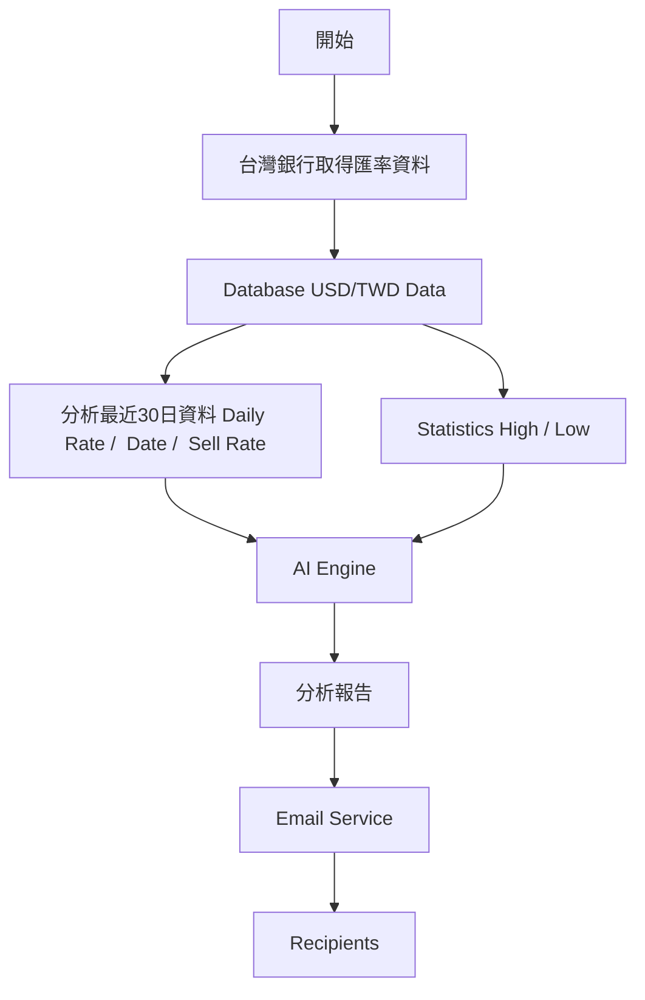

USD/TWD Exchange Rate Analysis & AI Report
一套以 Python 建置的美元兌新台幣（USD/TWD）匯率自動化分析系統。
系統透過排程程式定期擷取台灣銀行美元兌新台幣匯率資料，將資料儲存至資料庫，並以最近 30 日的匯率資料進行統計分析，再將原始匯率資料與計算結果提供給 AI 產生匯率分析報告，最後透過 Email 自動寄送給指定的相關人員。

專案目的
將原本需要人工執行的「匯率資料蒐集 → 資料儲存 → 統計分析 → 報告撰寫 → Email 發送」流程自動化。
透過排程機制定期執行，讓使用者可以收到包含近期匯率資料、統計資訊及 AI 分析報告的 Email。

技術架構圖

flowchart TB

    subgraph External["External Services"]
        Bank["台灣銀行"]
        AI["AI API"]
        Gmail+OAuth["Email"]
    end

    subgraph Application["Python Application"]
        Scheduler["Scheduler"]

        Collector["Crawler / Data Collector"]

        Analysis["Analysis Engine"]

        Reporter["AI Report Generator"]

        Mailer["Email Sender"]
    end

    subgraph Storage["Data Storage"]
        DB[("Database")]
    end

    Scheduler --> Collector
    Bank --> Collector
    Collector --> DB

    DB --> Analysis
    DB --> Reporter
    Analysis --> Reporter

    Reporter --> AI
    AI --> Reporter

    Reporter --> Mailer
    Mailer --> Gmail + OAuth


系統流程





主要功能
1. 自動擷取匯率資料
定期從台灣銀行取得美元兌新台幣匯率資料，並將資料寫入資料庫。
主要資料包含：

匯率日期
幣別
匯率
即期買入／賣出等相關匯率資訊
2. 資料庫儲存
將每日取得的匯率資料保存於資料庫，避免每次分析時都需要重新取得歷史資料。
資料庫也作為後續統計分析與 AI 分析的資料來源。

3. 30 日匯率統計分析
系統會取得最近 30 日的 USD/TWD 匯率資料，計算相關統計資訊，包括：
最高匯率
最低匯率
每日匯率變動率
30 日累積變動率
例如：
期間：2026/08/01 ～ 2026/08/30

起始匯率：32.10
最新匯率：31.85
最高匯率：32.20
最低匯率：31.70
累積變動率：-0.78%

實際數值會依資料庫中的匯率資料動態計算。
4. AI 匯率分析報告
系統將以下資料提供給 AI：
分析期間
最近 30 日每日匯率
最高匯率
最低匯率
每日匯率變動率
累積變動率
AI 根據提供的資料產生匯率分析報告。
分析內容主要包含：

期間概況
價格區間
波動程度
累積變化
資料趨勢觀察
風險與限制
AI 分析以提供的資料為基礎，不額外捏造不存在的市場資料。
5. Email 自動發送
完成資料分析及 AI 報告產生後，系統會自動建立 Email，將分析結果寄送給指定人員。
Email 內容包含：

USD/TWD 最近 30 日匯率資料
匯率統計資訊
AI 匯率分析報告
專案架構
以下為專案建議架構：
project/
│
├── src/
│   ├── app.py
│   ├── config.py
│   ├── bank_rate.py
│   ├── database.py  
│   ├── chart.py
│   │   
│   ├── ai_report.py   
│   │
│   ├── gmail_sender.py
│   ├── credentials.json   
│   ├── token.json   
│   
│
├── sql/
│   └── init.sql
│
│
├── .env
├── .gitignore
├── requirements.txt
└── README.md

技術流程
系統主要分為以下幾個階段：
Data Collection
從台灣銀行取得 USD/TWD 匯率資料。
Data Storage
將取得的資料寫入資料庫。
Data Analysis
從資料庫取得最近 30 日資料，計算匯率統計資訊。
AI Analysis
將每日匯率資料與統計結果傳送給 AI，產生自然語言分析報告。
Notification
將統計資料及 AI 分析結果整理成 Email 並寄送。
排程執行
系統可透過排程機制定期執行，例如：
Scheduler
    ↓
取得最新匯率
    ↓
寫入 Database
    ↓
取得最近 30 日資料
    ↓
計算統計資訊
    ↓
AI 產生分析報告
    ↓
Email 發送

實際排程方式可依部署環境使用：
Windows Task Scheduler
Linux Cron
Docker / Container Scheduler
Cloud Scheduler
CI/CD Scheduled Job
統計計算
每日匯率變動率
每日匯率變動率可依前一交易日匯率計算：
每日變動率 =
(當日匯率 - 前一交易日匯率)
÷ 前一交易日匯率 × 100%

累積變動率
以分析期間第一筆與最後一筆匯率計算：
累積變動率 =
(最新匯率 - 起始匯率)
÷ 起始匯率 × 100%

AI 分析原則
AI 分析報告遵循以下原則：
僅根據系統提供的資料進行分析。
不捏造不存在的市場資料。
明確區分「資料觀察」與「可能的解讀」。
當資料不足以支持某項結論時，明確說明限制。
不提供投資買賣建議。
分析結果僅作為資料整理與市場資訊參考。
環境需求
建議環境：
Python 3.x
Database
AI API
Gmail + OAuth

Python 套件可透過：
pip install -r requirements.txt

安裝。
環境變數
敏感資訊不應直接寫入程式碼或提交至 GitHub。
建議使用 .env：

DATABASE_HOST=
DATABASE_PORT=
DATABASE_NAME=
DATABASE_USER=
DATABASE_PASSWORD=

AI_API_KEY=

EMAIL_FROM=
EMAIL_TO=

並提供 .env.example：
DATABASE_HOST=
DATABASE_PORT=
DATABASE_NAME=
DATABASE_USER=
DATABASE_PASSWORD=

AI_API_KEY=

EMAIL_FROM=
EMAIL_TO=

.env 應加入 .gitignore：
.env


安裝與執行
Clone 專案：
git clone <repository-url>
cd <project-directory>

建立虛擬環境：
python -m venv venv

啟用虛擬環境：
Windows：

venv\Scripts\activate

Linux / macOS：
source venv/bin/activate

安裝套件：
pip install -r requirements.txt

設定 .env：
cp .env.example .env

填入資料庫、AI API 及 Email 所需的設定後執行：
python src/app.py

安全性注意事項
本專案涉及資料庫、AI API 及 Email 帳號資訊，因此請注意：
不要將 API Key 提交至 GitHub。
不要將資料庫密碼提交至 GitHub。
不要將 Gmail 密碼提交至 GitHub。
.env 應加入 .gitignore。
建議使用 .env.example 提供必要的環境變數格式。
若 API Key 或密碼不慎提交，應立即撤銷並重新產生。
credentials.json、token.json、.env 等檔案包含敏感資訊，
不得提交至 Git repository。

專案特色
本專案將以下技術整合在單一自動化流程：
Web Data Collection
        +
Database
        +
Data Analysis
        +
AI
        +
Email Automation
        =
Automated Financial Data Analysis


## Gmail OAuth Setup

本專案使用 Gmail API 透過 OAuth 2.0 進行 Email 發送。

由於 `credentials.json` 與 `token.json` 包含 OAuth 相關敏感資訊，
這些檔案不會提交至 GitHub。

### Setup

1. 建立 Google Cloud Project。
2. 啟用 Gmail API。
3. 建立 OAuth 2.0 Client ID。
4. 下載 OAuth client credentials。
5. 將檔案重新命名為：

```text
credentials.json

6.將 credentials.json 放在專案指定目錄。
7.第一次執行程式時完成 Google OAuth 授權。
8.授權完成後會產生：
token.json
credentials.json 與 token.json 均應保留在本機，
不要提交至 GitHub。


透過自動化流程，將原始匯率資料轉換為結構化統計資訊與自然語言分析報告，降低人工整理資料與撰寫報告的工作量。
Disclaimer
本專案主要用於金融市場資料擷取、資料分析及 AI 報告產生的技術展示。
AI 產生的內容僅反映所提供資料的分析結果，不構成投資、交易、財務或其他專業建議。匯率資料及分析結果可能受到資料來源、資料完整性及 AI 生成內容等因素影響。

License
本專案採用 MIT License。
請參閱 LICENSE。